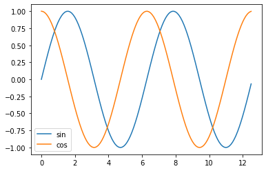
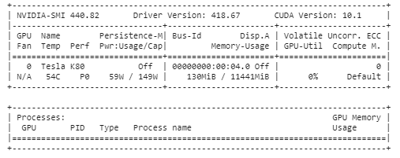
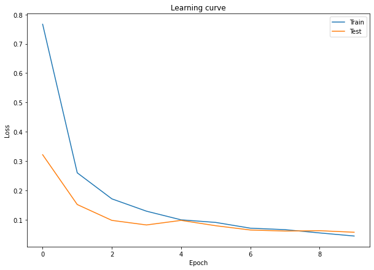
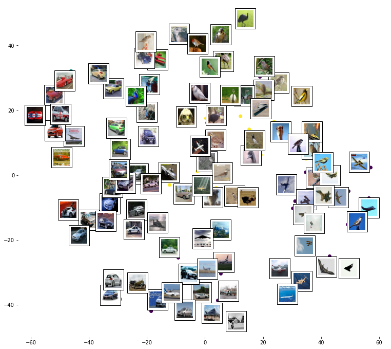
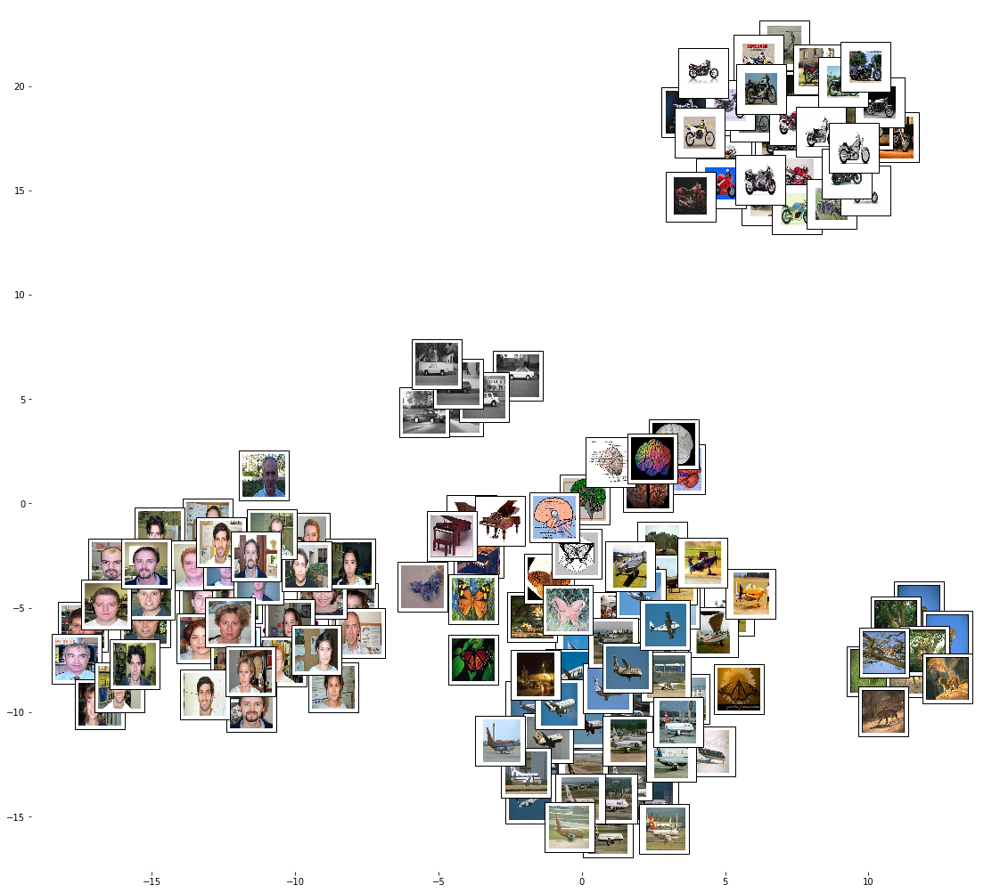
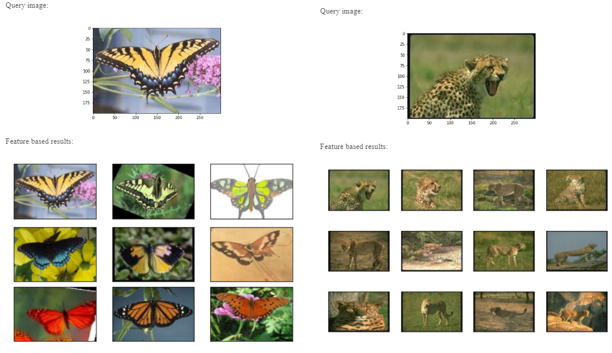

# Practical Image Classifcation with Keras:

- Hello Colab
- Image Classification
- Pretrained Feature Vizualization
- Transfer Learning
- Feature Based Image Search

---

## 01 HelloColab.ipynb

Basic Colab demo

---
## 02 ImageClassification.ipynb

In this code, we are going to implement a basic image classifier:
- Load the dataset (MNIST hand written digits)
- Design a deep learning model and inspect its learnable parameters
- Train the model on the training data and inspect learning curves
- Evaluate the trained model on the never seen testing data
- Save the model for later use
- Load and use the model

---
## 03 PretrainedFeatureViz .ipynb

In this code we are going to load pretrained image classification networks
- ResNet50
- VGG16
- VGG19

Then using a **pretrained network**, **feature extraction** and **visualization** is conducted via **t-SNE**

---
## 04 TransferLearning.ipynb

In Transfer learning, we would like to leverage the knowledge learned by a source task to help learning another target task. For example, a well-trained, rich image classification network could be leveraged for another image target related task. Another example, the knowledge learned by a network trained on simulated environment can be transferred to a network for the real environment. Basically, there are two basic scenarios for neural networks transfer learning: 
- **Feature Extraction** 
- **Fine Tuning**   

A well known example for transfer learning is to load the already trained large scale classification VGG network that is able to classify images into one of 1000 classes, and use it for another task such as classification of special medical images.

---
## 05 FeatureBasedImageSearch.ipynb

Image search engines: Generally speaking, search engine usually takes a query and returns results. Image search engines takes an input image as an image query, then the image search engine finds the "similar" images within its indexed database and returns them as the search result. How to measure similarity between two images?
- **Pixel space**: One simple way is to measure the euclidean distance between the two images in the pixel space. Accordingly, if two images have common or near values for the corresponding pixels, are then considered "similar". This could work some times, however a dolphin and air plane images with blue backgrounds will be considered similar from pixels point of view, and we do not want that!
- **Feature space**: Another approach is to use the feature space instead of pixel space when computing the euclidean distance between the two images. In other words, project the images into a space where images with similar features are close to each others. In this space dolphins and airplanes are separated despite pixel level similarity.

